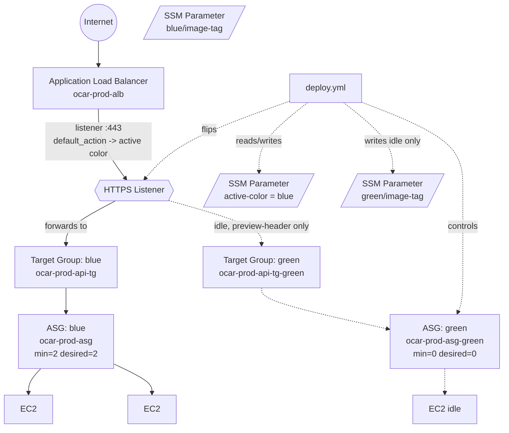
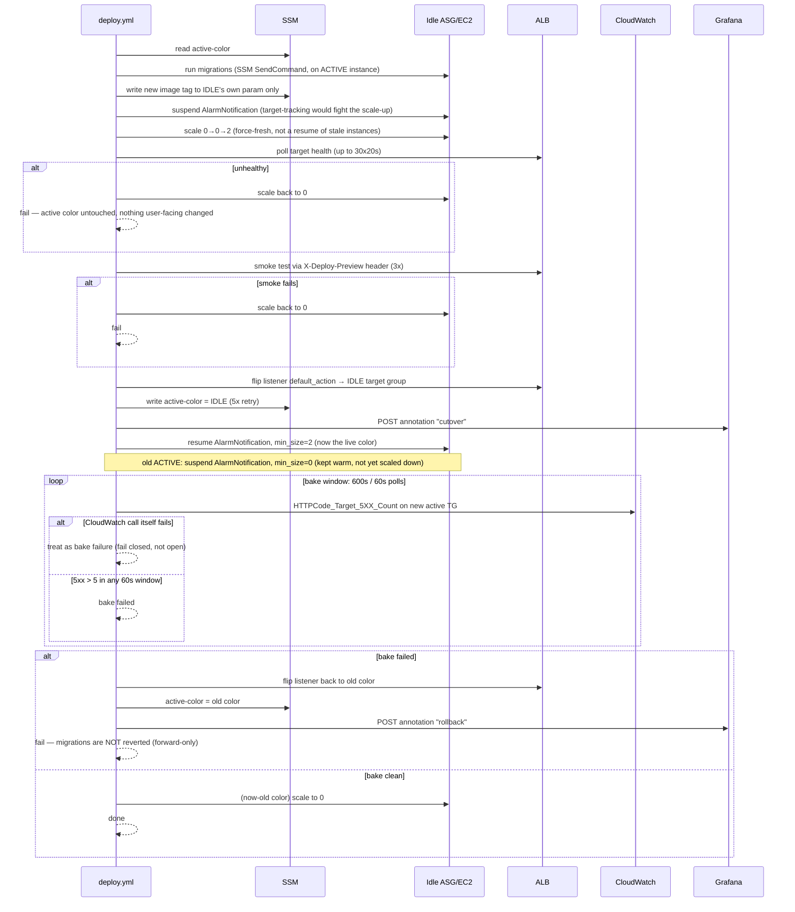

# Blue/Green Deployment — Architecture

As-built reference for how zero-downtime deploys work in production. For "how do I deploy /
rollback / diagnose a failure," see `docs/OPS_RUNBOOK.md`. For the original design rationale
(written before this was built), see `docs/superpowers/specs/2026-08-28-blue-green-deployment-design.md`.

---

## 1. Static architecture

Two complete, parallel stacks ("colors") sit behind one ALB. Only one color is ever live;
the other is either scaled to zero (steady state) or warming up / draining (mid-deploy).

**Why two ASGs/target groups instead of one that just gets new instances added:** the whole
point is that the *new* code runs on entirely separate instances behind an entirely separate
target group, health-checked and smoke-tested **before** any real user traffic reaches it. A
rolling-update-in-place on one ASG can't offer that — a bad instance would serve live traffic
the moment it passes its own health check, with no independent gate.

**The one asymmetry, and why it's permanent:** `blue` is the pre-existing ASG/target
group/launch template from before blue/green existed. AWS does not allow renaming these
resource types (`name`/`name_prefix` is immutable — any change forces destroy-then-recreate of
a live, traffic-serving resource). So blue keeps its original unsuffixed name
(`ocar-prod-asg`, `ocar-prod-api-tg`) forever; green uses the clean `-green` suffix. This is
baked into `infra/terraform/asg.tf`, `alb.tf`, `launch-template.tf`, and mirrored by
`deploy.yml`'s `asg_name()`/`tg_name()` shell functions. It's cosmetic, not a hazard.

---

## 2. Deploy sequence

One workflow (`.github/workflows/deploy.yml`, job `deploy`) runs this on every push to `main`
that touches `api/**` or the lockfile. `ACTIVE` = the color currently serving traffic, `IDLE` =
the other one.

**Two independent windows, easy to conflate — they solve different problems:**

| | Drain window | Bake window |
|---|---|---|
| Where | ALB target-group attribute (`deregistration_delay = 300`) | `deploy.yml`, `BAKE_SECONDS = 600` |
| What it protects | In-flight requests/connections on the *old* color when it's finally deregistered | The decision of whether the *new* color is actually healthy under real traffic |
| Triggers on | Old color being scaled to 0 (only fires *after* a clean bake) | Immediately after the listener flip |
| Failure mode if skipped | Active requests get cut off mid-response | A subtly broken deploy looks "healthy" (passed synthetic smoke test) but errors under real traffic, and nobody notices for 10+ minutes |

They're sequential, not overlapping: bake happens first (10 min, decides whether to keep the
new color); only once bake is clean does the old color get scaled down, and *that's* when its
300s drain grace period matters.

---

## 3. Cautions taken — and why each one is load-bearing

Every item below was a real incident during this build, not a hypothetical. Each fix is a
permanent invariant, not a one-off patch.

- **`min_size` redundancy floor swap.** The live color's ASG needs `min_size=2` at all times,
  or its own target-tracking scaling policy can legally take it below 2 on a quiet-traffic
  window — happened for real during the initial migration, had to be corrected by hand on
  production. `deploy.yml`'s cutover step and the Terraform `for_each` formula
  (`min_size = each.key == var.active_color ? 2 : 0`) both encode "whichever color is live
  gets the floor," swapped on every flip and every rollback.

- **`suspended_processes` (AlarmNotification) on the idle color.** Target-tracking scaling
  reacts to `ALBRequestCountPerTarget`, which is ~zero for the idle color right up until
  cutover. Without suspending it first, the policy scales the idle color straight back to 0
  seconds after `deploy.yml` sets `desired_capacity=2`, and the idle color never actually
  comes up. `infra/terraform/asg.tf` has `lifecycle.ignore_changes = [suspended_processes]` so
  Terraform doesn't fight the runtime toggling this on every deploy.

- **Immutable-name force-replace hazard.** `terraform plan` against the live migration showed
  all 4 blue-color resources (`ASG`, `target group`, `launch template`, `scaling policy`)
  wanting `must be replaced` — because their `name`/`name_prefix` is immutable and the
  `for_each` conversion would have generated a new name. Fixed with the permanent
  blue-keeps-legacy-name exception described in §1. A `terraform apply` here would have
  destroyed and recreated the ASG actually serving production traffic.

- **IAM `Describe*` resource-level scoping.** `elasticloadbalancing:DescribeTargetHealth` /
  `DescribeTargetGroups` / `DescribeListeners` do not support resource-level ARNs at all —
  found live via a real `AccessDenied` mid-deploy. Fixed by merging those three actions into
  one IAM statement scoped to `Resource: "*"` in `infra/terraform/github-oidc.tf`. (Actions
  that *do* support resource-level ARNs — `ModifyListener`, `UpdateAutoScalingGroup`,
  `Suspend/ResumeProcesses` — stay scoped to the two exact ARNs, least-privilege where AWS
  actually allows it.)

- **SSM active-color write is not atomic with the listener flip.** `modify-listener` succeeding
  and the subsequent `ssm put-parameter` failing would leave the ALB pointed at the new color
  while `active-color` still says the old one — the *next* deploy would then misidentify idle
  vs. live and cycle the actually-live color. Mitigated with a 5x retry loop plus a loud,
  explicit manual-recovery command printed on exhaustion (not a silent failure).

- **Idle-scale-up idempotency.** "Scale idle up" always goes 0→0→2, never a bare "set to 2" —
  if the previous deploy's bake failed, the idle ASG was deliberately left at `desired=2` for
  inspection; a bare "set 2" would be a no-op and the health/smoke checks below it would
  validate the *previous, already-bad* instances instead of the image tag just written.

- **Bake window fails closed, not open.** The original `BAKE_POLL_INTERVAL=30` was invalid —
  `HTTPCode_Target_5XX_Count` is a standard-resolution CloudWatch metric and `--period` must be
  a multiple of 60, so every bake-window query silently failed and read as "zero errors"
  regardless of real 5xx volume. Fixed to `60`, plus an explicit exit-status check on the `aws
  cloudwatch` call: a broken metrics query is now treated as a bake *failure*, not a pass.

- **Grafana Cloud active-series overage broke the "Live Instances" panel** (found via a user
  report of the panel showing 0). Root cause: unfiltered `node_exporter` (~500-700 series per
  host) combined with several rapid instance refreshes during the migration blew past the
  15,000-series free-tier cap. Fixed with two-layer filtering — a source-level
  `--collector.netdev.device-exclude` flag plus an Alloy `prometheus.relabel` keep-list of
  ~15 metric families — verified converging via live rejected-sample counts (1260 → 46 → 22 →
  11 → 7).

---

## 4. Known limitations (stated plainly, not glossed over)

- **No staging deploy path.** `deploy.yml` is hardcoded to `ENVIRONMENT=prod` /
  `ALB_NAME=ocar-prod-alb` / `/ocar/prod/active-color`, triggered only by `workflow_run` off
  pushes to `main`. There is currently no way to run this exact workflow against staging.
- **Socket.io reconnect behavior under a real flip has not been observed** with a live client
  connected during cutover.
- **Grafana Cloud free tier caps metrics retention at 14 days** — fine for incident
  diagnosis, not for month-over-month trend analysis.
- Every fix above was validated against real production incidents this build produced, not
  against synthetic tests — see `docs/OPS_RUNBOOK.md` → "Diagnose a failed blue/green deploy"
  for the same list written as an operator-facing runbook.
